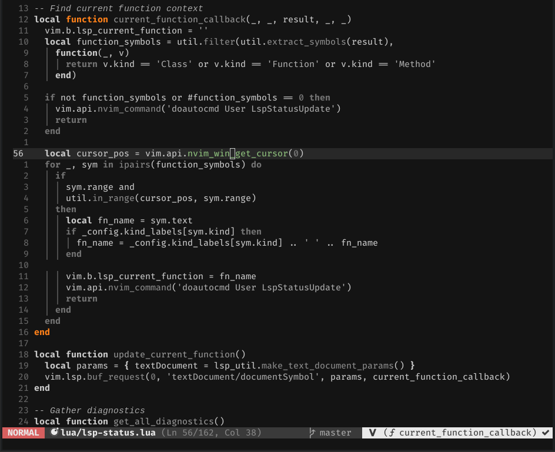
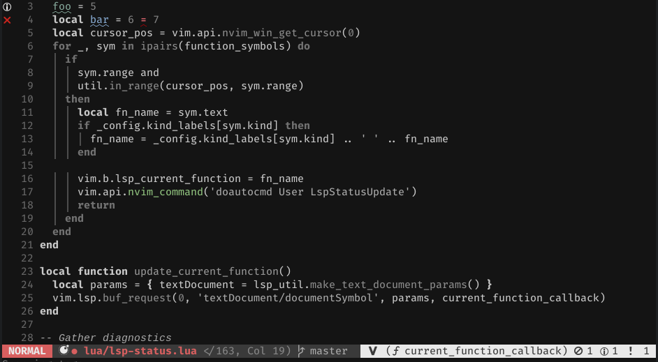

# lsp-status.nvim

This is a Neovim plugin/library for generating statusline components from the built-in LSP client.

## Contents
1. [Examples](#examples)
2. [Installation](#installation)
3. [Usage](#usage)
    1. [Protocol Extensions](#protocol-extensions)
    2. [Configuration](#configuration)
4. [Example Use](#example-use)
5. [Status](#status)
6. [Contributing](#contributing)


## Examples

Show the current containing function (like `b:coc_current_function`):


Easily access diagnostic counts:


Show progress messages from servers:


## Installation

You will need a version of Neovim that includes the built-in LSP client (right now, that means
nightly). Use your preferred package/plugin manager. With
[`vim-packager`](https://github.com/kristijanhusak/vim-packager), this looks like:
```vim
call packager#add('wbthomason/lsp-status.nvim')
```

## Usage

The plugin provides several functions which you can call:
```lua
update_current_function() -- Set/reset the b:lsp_current_function variable
diagnostics() -- Return a table with all diagnostic counts for the current buffer
messages() -- Return a table listing progress and other status messages for display
register_progress() -- Register the provided callback for progress messages
register_client() -- Register a client for messages
-- A table of callbacks to integrate misc. LS protocol extensions into the messages framework
extension_callbacks 
config(config_vals) -- Configure lsp-status
```
### Protocol Extensions

`lsp-status.nvim` supports messaging-related protocol extensions offered by
[`clangd`](https://clangd.llvm.org/extensions.html#file-status) and [Microsoft's Python language
server](https://github.com/Microsoft/python-language-server) (`python/setStatusBarMessage`,
`python/beginProgress`, `python/reportProgress`, and `python/endProgress`). To use these extensions,
register the callbacks provided in the `extension_callbacks` table (the keys for the callbacks are
the relevant LSP method name).

### Configuration

You can configure `lsp-status.nvim` using the `config` function, which takes a table of
configuration values. The following configuration options are supported:

- `kind_labels`: An optional map from LSP symbol kinds to label symbols. Used to decorate the current function
  name. Default: `{}`
- `select_symbol`: An optional callback of the form `function(cursor_pos, document_symbol)` that
  should return `true` if `document_symbol` (a `DocumentSymbol`) should be accepted as the symbol
  currently containing the cursor.

For example, the [sumneko lua server](https://github.com/sumneko/lua-language-server) sends
`valueRange` (which is not specified in the protocol) to give the range for a function's start and
end. To respect `valueRange`, you can use the following configuration:
```lua
lsp_status.config {
  select_symbol = function(cursor_pos, symbol)
    if symbol.valueRange then
      local value_range = {
        ["start"] = {
          character = 0,
          line = vim.fn.byte2line(symbol.valueRange[1])
        },
        ["end"] = {
          character = 0,
          line = vim.fn.byte2line(symbol.valueRange[2])
        }
      }

      return require("lsp-status.util").in_range(cursor_pos, value_range)
    end
  end
}
```

## Example Use

Here is an example configuration (also using [`nvim-lsp`](https://github.com/neovim/nvim-lsp/))
showing how `lsp-status` can be integrated into one's statusline and other LSP configuration.

### `nvim-lsp` config
In any Lua file you load:
```lua
local lsp_status = require('lsp-status')
-- completion_customize_lsp_label as used in completion-nvim
lsp_status.config { kind_labels = vim.g.completion_customize_lsp_label }

-- Register the progress callback
lsp_status.register_progress()
```

In an `on_attach` function for each relevant LSP client:
```lua
-- Register the client for messages
lsp_status.register_client(client.name)

-- Set up autocommands for refreshing the statusline when LSP information changes
vim.api.nvim_command('augroup lsp_aucmds')
vim.api.nvim_command('au! * <buffer>')
vim.api.nvim_command('au User LspDiagnosticsChanged redrawstatus!')
vim.api.nvim_command('au User LspMessageUpdate redrawstatus!')
vim.api.nvim_command('au User LspStatusUpdate redrawstatus!')
vim.api.nvim_command('augroup END')

-- If the client is a documentSymbolProvider, set up an autocommand 
-- to update the containing function
if client.resolved_capabilities.document_symbol then
  vim.api.nvim_command('augroup lsp_aucmds')
  vim.api.nvim_command(
  'au CursorHold <buffer> lua require("lsp-status").update_current_function()'
  )
  vim.api.nvim_command('augroup END')
end
```

Specific client configuration (again, following `nvim-lsp` conventions):
```lua
clangd = {
  callbacks = {
    ['textDocument/clangd.fileStatus'] = 
      lsp_status.extension_callbacks.clangd['textDocument/clangd.fileStatus']
  }
},
pyls_ms = {
  callbacks = {
    ['python/setStatusBarMessage'] =
      lsp_status.extension_callbacks.pyls_ms["python/setStatusBarMessage"],
    ['python/reportProgress'] =
      lsp_status.extension_callbacks.pyls_ms["python/reportProgress"],
    ['python/beginProgress'] = 
      lsp_status.extension_callbacks.pyls_ms["python/beginProgress"],
    ['python/endProgress'] = 
      lsp_status.extension_callbacks.pyls_ms["python/endProgress"],
  }
},
```

### LSP statusline segment

```lua
vim.g.indicator_errors = ''
vim.g.indicator_warnings = ''
vim.g.indicator_info = '🛈'
vim.g.indicator_hint = '❗'
vim.g.indicator_ok = ''
vim.g.spinner_frames = ['⣾', '⣽', '⣻', '⢿', '⡿', '⣟', '⣯', '⣷']

local lsp_status = require('lsp-status')
local aliases = {
  pyls_ms = 'MPLS',
}

local function statusline_lsp()
  if #vim.lsp.buf_get_clients() == 0 then
    return ''
  end

  local diagnostics = lsp_status.diagnostics()
  local buf_messages = lsp_status.messages()
  local only_hint = true
  local some_diagnostics = false
  local status_parts = {}
  if diagnostics.errors and diagnostics.errors > 0 then
    table.insert(status_parts, vim.g.indicator_errors .. ' ' .. diagnostics.errors)
    only_hint = false
    some_diagnostics = true
  end

  if diagnostics.warnings and diagnostics.warnings > 0 then
    table.insert(status_parts, vim.g.indicator_warnings .. ' ' .. diagnostics.warnings)
    only_hint = false
    some_diagnostics = true
  end

  if diagnostics.info and diagnostics.info > 0 then
    table.insert(status_parts, vim.g.indicator_info .. ' ' .. diagnostics.info)
    only_hint = false
    some_diagnostics = true
  end

  if diagnostics.hints and diagnostics.hints > 0 then
    table.insert(status_parts, vim.g.indicator_hint .. ' ' .. diagnostics.hints)
    some_diagnostics = true
  end

  local msgs = {}
  for _, msg in ipairs(buf_messages) do
    local name = aliases[msg.name] or msg.name
    local client_name = '[' .. name .. ']'
    if msg.progress then
      local contents = msg.title
      if msg.message then
        contents = contents .. ' ' .. msg.message
      end

      if msg.percentage then
        contents = contents .. ' (' .. msg.percentage .. ')'
      end

      if msg.spinner then
        contents = vim.g.spinner_frames[(msg.spinner % #vim.g.spinner_frames) + 1] .. ' ' .. contents
      end

      table.insert(msgs, client_name .. ' ' .. contents)
    else
      table.insert(msgs, client_name .. ' ' .. msg.content)
    end
  end

  local base_status = vim.trim(table.concat(status_parts, ' ') .. ' ' .. table.concat(msgs, ' '))
  local symbol = ' 🇻' .. ((some_diagnostics and only_hint) and '' or ' ')
  local current_function = vim.b.lsp_current_function
  if current_function and current_function ~= '' then
    symbol = symbol .. '(' .. current_function .. ') '
  end

  if base_status ~= '' then
    return symbol .. base_status .. ' '
  end

  return symbol .. vim.g.indicator_ok .. ' '
end

local M = {
  lsp = statusline_lsp
}

return M
```

Call `statusline.lsp()` somewhere in your `statusline` definition.

## Status

This plugin is "complete" - it works in all the ways it was originally intended to, and it doesn't
seem to break. That said, it hasn't been tested much, and I'm open to adding new features if others
want them.

One thing that probably should be added is proper documentation of some sort. The code could also
stand to be cleaned up.

## Contributing

Bug reports and feature requests are welcome! PRs are doubly welcome!
